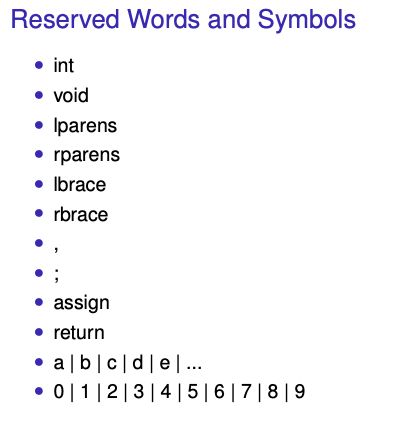
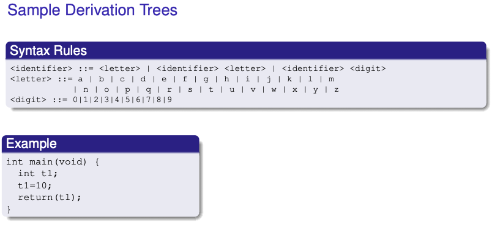
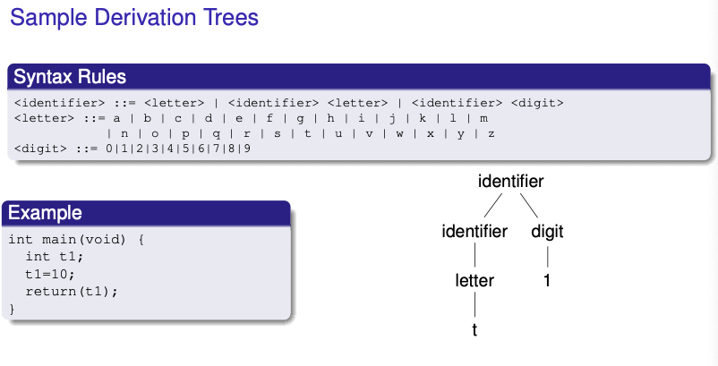
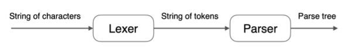
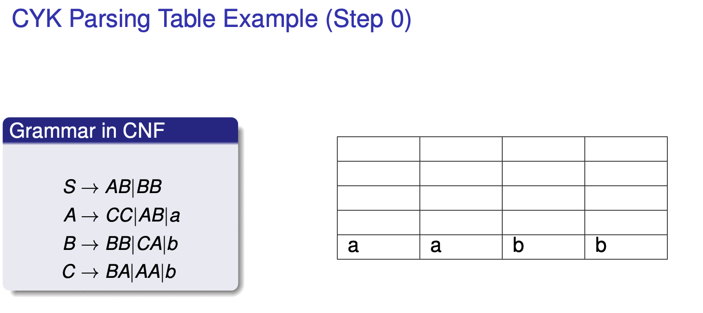
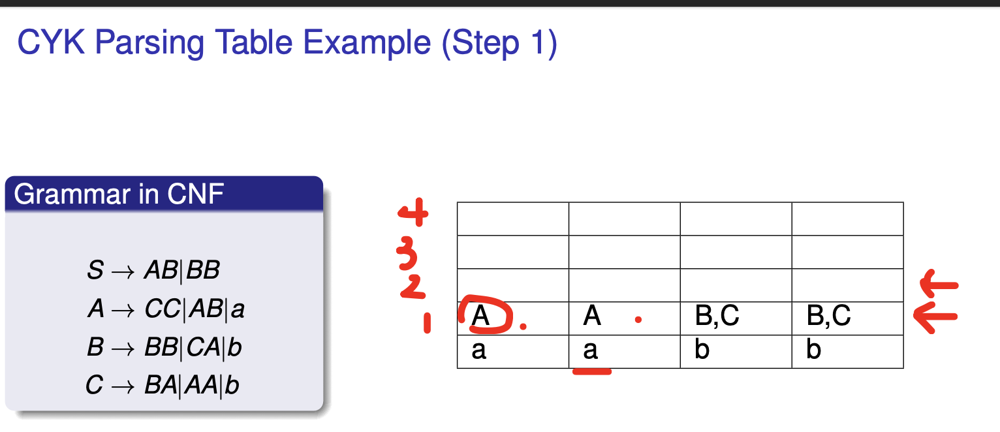
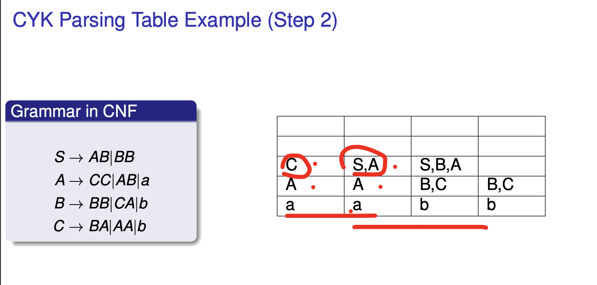
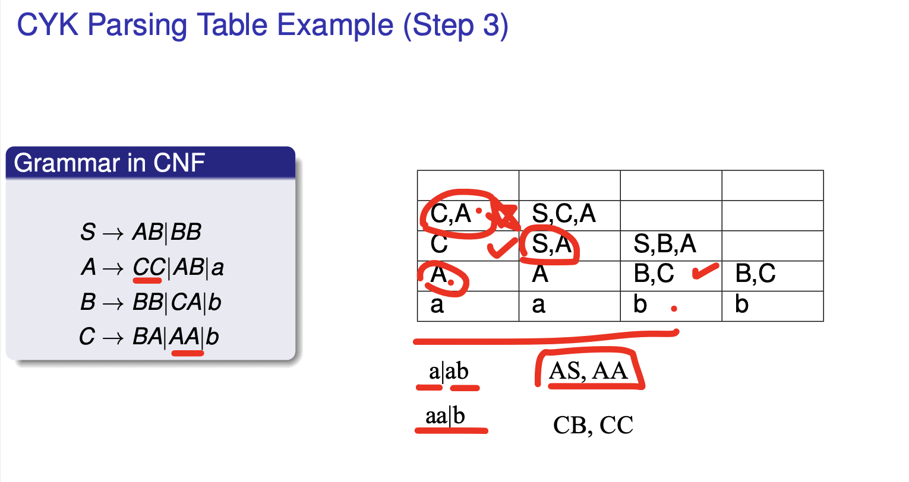
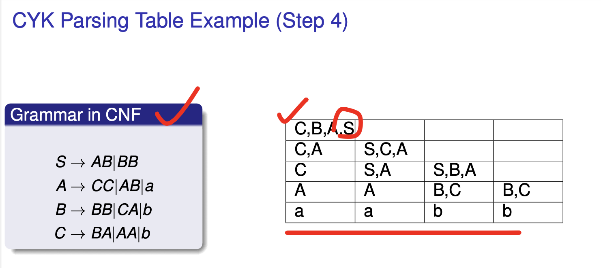
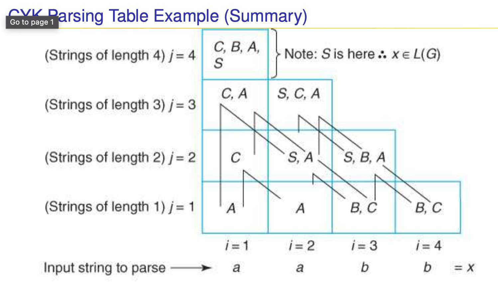

# *minic (ver 1) Syntax*

minic is a toy language modeled after a subset of C, used to demonstrate grammar-based language generation and recognition.

```minic
<transunit> ::= <main-decl> <body>
<main-decl> ::= <type> main <arg>
<type> ::= int | void
<arg> ::= lparens <type> rparens
<body> ::= lbrace <decl> <statseq> rbrace
<decl> ::= e | <type> <variable-list>;
<variable-list> ::= <variable> | <variable> , <variable-list>
<variable> ::= <identifier>
<statseq> ::= <return-stat> | <command-seq>; <return-stat>
<command-seq> ::= <command> | <command> ; <command-seq>
<command> ::= <variable> assign <expr>
<expr> ::= <numeral>
<return-stat> ::= return <return-arg>;
<return-arg> ::= lparens <variable> rparens | lparens <numeral> rparens
```

### Lexical Rules
```
<identifier> ::= <letter> | <identifier> <letter> | <identifier> <digit>
<letter> ::= a | b | ... | z
<digit> ::= 0 | 1 | ... | 9
<numeral> ::= <digit> | <digit> <numeral>
``` 
 
### Terminal Meaning
**Terminal**    **Meaning**  
lparens	            (  
rparens	            )  
lbrace	            {  
rbrace	            }  
assign	            =  

### Question
What identifier can minic generate?  
t1?  
t11?  
1t?  

### Answer
Based on the lexical rules:  
- `t1`: Valid. `<identifier>` can start with a `<letter>` followed by a `<digit>`.  
- `t11`: Valid. `<identifier>` can start with a `<letter>` followed by multiple `<digit>`s.  
- `1t`: Invalid. `<identifier>` cannot start with a `<digit>`.  

### Example minic program
```minic
int main(void) {
    int t1;
    t1 = 10;
    return(t1);
}
```
---

# *minic Syntax Subdivision*
minic syntax is divided into three main parts:

**Structural productions**: high-level structure (e.g., main declaration, statment sequence)

**Reserved words and symbols**: int, void, {, }, ;, etc.

**User-formed pseudo-terminals**: identifiers and numerals (e.g., t1, 10), String representing numbers and identifiers

### Reerved words and symbols



---

# *Tokens*
A token is a syntactic category (like noun/verb in English)

Programming token examples:

**Identifier**: letters/digits starting with a letter (e.g., t1)

**Integer**: non-empty string of digits (e.g., 42)

**Keyword**: reserved words like return, if, void

**Whitespace**: space, newline, or tabs (non-empty sequences)

---

# *Two Essential Steps in Parsing*
**Scanning (Lexical Analysis)**
    Recognizes valid terminals
    Converts them into pseudo-terminals/tokens

**Parsing (Syntactic Analysis)**
    Checks if token sequence follows grammar rules
    Builds a derivation (parse) tree

### Understanding Derivation Trees in minic
Derivation trees show how strings like identifiers and numerals are generated from grammar rules. Each branch follows a production rule defined in the language's syntax.



**Identifier Derivation – t1**
```
<identifier> ::= <letter> 
              | <identifier> <letter> 
              | <identifier> <digit>
<letter> ::= a | b | ... | z
<digit> ::= 0 | 1 | ... | 9
```
Tree breakdown:
identifier
├── identifier
│   └── letter
│       └── t
└── digit
    └── 1

We start from <identifier>
It branches into <identifier> <digit> (since t1 ends in a digit)
The inner <identifier> resolves to a <letter> → t
The <digit> becomes 1
✔️ So t1 is a valid identifier: it starts with a letter and ends with a digit.



**Numeral Derivation – 10**
```
<numeral> ::= <digit> 
           | <digit> <numeral>
<digit> ::= 0 | 1 | ... | 9
```
Tree breakdown: 
numeral
├── digit
│   └── 1
└── numeral
    └── digit
        └── 0

We start from <numeral>
Use the rule <digit> <numeral> to break down 10
First digit: 1 → <digit>
The remaining numeral: 0 → another <digit>
✔️ This shows that numerals like 10 are parsed recursively, digit by digit.

```
int main(void) {
    int t1;
    t1 = 10;
    return(t1);
}
```
*t1* is an identifier
*10* is a numeral
Each is parsed using its respective rules, with the derivation trees confirming their validity.

---

# *Concerns in the Development of a Parser for minic*
The overall syntax of a lanuguage is divided into two parts: 

**Lexical Structure**
    The lexical structure deals with recognizing tokens — the smallest meaningful elements in a program.
        Tokens are like parts of speech in English grammar: nouns, verbs, etc.
        In programming, tokens include:
            Identifiers
            Integers
            Keywords
            Whitespace
            Symbols
    Lexical rules define what character patterns are valid for each token type.
    For example: 
        ```
        <identifier> ::= <letter> | <identifier> <letter> | <identifier> <digit>
        <letter> ::= a | b | ... | z
        <digit> ::= 0 | 1 | ... | 9
        ```
        Valid: t1, hello99, main, value1
        Invalid: 1t, 99start (they start with digits)

**Syntactics Structure**


The syntactic structure defines how tokens are combined to form valid statements and programs. It focuses on grammar and production rules.
- Tokens like int, main, (, ), {, } form part of a structured abstract syntax tree (AST).
- The parser uses these rules to construct a derivation tree from the token stream.

---

# *Tokens*
A token is a category of lexical units. It represents a group of strings that share the same syntactic role.
**Examples of tokens in minic**:
    Identifier: Strings that begin with a letter, followed by any number of letters or digits
        Examples: t1, x5, main
    Integer: A non-empty string of digits
        Examples: 42, 0, 1010
    Keyword: Reserved words with fixed meaning
        xamples: if, else, return, void, int, while, main
    Whitespace: Any sequence of spaces, tabs, or newlines (used to separate tokens)
    Symbols (also called punctuation):
        Examples:
        lparens → (
        rparens → )
        lbrace → {
        rbrace → }
        assign → =
        , and ;

### Two Essential Components of Syntactic Analysis
**1. Scanning (Lexical Analysis)** 
    Input: Raw source code
    Output: A sequence of tokens

    Scanning breaks up the source into known patterns and assigns token types
    Example:
    Code: int t1 = 10;
    Token stream:
    int → KEYWORD
    t1 → IDENTIFIER
    = → ASSIGN
    10 → INTEGER
    ; → SEMICOLON

**2. Parsing (Syntactic Analysis)**
    Input: Token stream from the scanner
    Output: *A parse tree or derivation tree*
    It checks whether the sequence of tokens matches the grammar
    Determines hierarchical structure (what is a declaration, what is an expression, etc.)


---

# *Specification of the Parsing Problem*
Given:
A string x and grammar G = (VT, VN, P, S)

Goal:
Build the parse tree from *S* to *x*

**Two parsing methods:**
    *Top-down*: expand from S toward the string
        Begins at S (start symbol)
        Applies production rules to expand non-terminals
        Goal: Generate the input string from the root
    *Bottom-up*: reduce the string back to S
        Begins with the input tokens
        Applies production rules in reverse (called reductions)
        Goal: Collapse tokens into the start symbol S

---

# *CYK (Cocke-Younger-Kasami) Parsing Algorithm*
CYK is a bottom-up parser specifically for context-free grammars in Chomsky Normal Form (CNF).
```
A → BC  (Two non-terminals)
A → a   (A single terminal)
```
We can use CYK to:
    Determine whether a given string x belongs to the language defined by G
    Build a parsing table in O(n³) time, where n is the length of the string

### CYK Algorithm Steps
1. Convert grammar G to CNF
2. Initialize a table T[n][n], where n is the length of input string
    T[i][j] stores the set of non-terminals that can derive the substring x[i..j]
3. Base case:
    For each character xi, find all A → xi and add A to T[i][i]
4. Recursive step:
    For substrings of increasing length, apply rules like A → BC
    If B ∈ T[i][k] and C ∈ T[k+1][j], then add A to T[i][j]x
5. Final step:
    If the start symbol S is in T[1][n], the string is valid

Example Grammar for CYK
```
S → AB | BB
A → CC | AB | a
B → BB | CA | b
C → BA | AA | b
```
Example String: aabb
    Use CYK to fill the parsing table
    Final step: check if S appears in top-right cell of the table





^First row @ bottom: You can get *a* from *A* and *b* from *B* OR *C*
**Hence A | A | BC | BC**



^Second row @ bottom: We take the cartesian product of row[i] and row[i+1]
Hence: 
    The cartesian product of A * A = AA. 
        AA can be found in C
        `C → BA | AA | b`
    The cartesian product of A * BC = AB, AC. 
        AB can be found in S AND A. 
        `A → CC | AB | a`
        AC is not in the rule
    The cartesian product of BC * BC = BB, BC, CB, CC.
        BB can be found in S AND B
        `S → AB | BB`
        `B → BB | CA | b`
        BC is not in the rule
        CB is not in the rule
        CC can be found in A
        `A → CC | AB | a`
**Hence: C | SA | SBA**
    


^Third row @ bottom: We are going to look at three letters at a time 



^Forth row @ bottom: 




